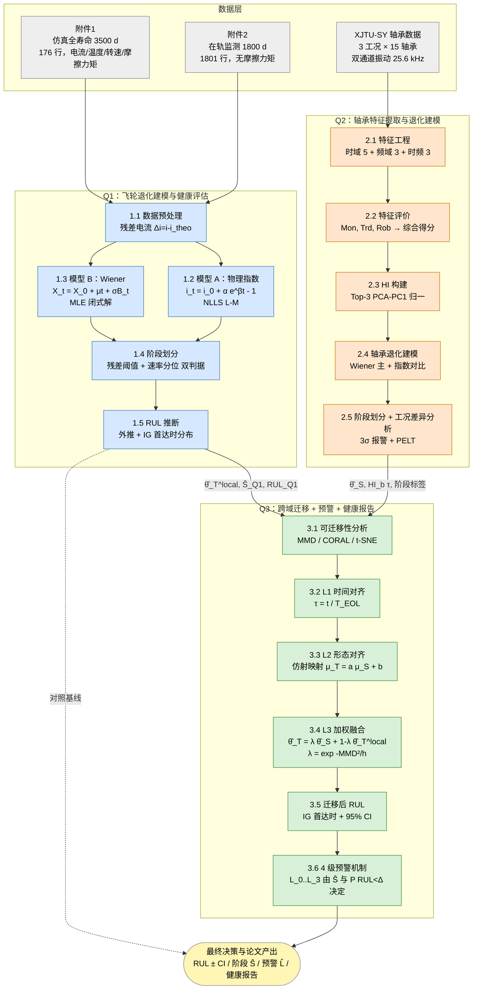

# 技术路线图（Mermaid 源）

> 渲染后导出为 PNG / PDF，保存至 `paper/figures/技术路线图.png`，由论文手在 `1_introduction.tex` 或 `3_model.tex` 引用。

```mermaid
flowchart TD
    subgraph DATA [数据层]
        D1[附件1<br/>仿真全寿命 3500 d<br/>176 行，电流/温度/转速/摩擦力矩]
        D2[附件2<br/>在轨监测 1800 d<br/>1801 行，无摩擦力矩]
        D3[XJTU-SY 轴承数据<br/>3 工况 × 15 轴承<br/>双通道振动 25.6 kHz]
    end

    subgraph Q1 [Q1：飞轮退化建模与健康评估]
        Q1A[1.1 数据预处理<br/>残差电流 Δi=i-i_theo]
        Q1B[1.2 模型 A：物理指数<br/>i_t = i_0 + α e^βt - 1<br/>NLLS L-M]
        Q1C[1.3 模型 B：Wiener<br/>X_t = X_0 + μt + σB_t<br/>MLE 闭式解]
        Q1D[1.4 阶段划分<br/>残差阈值 + 速率分位 双判据]
        Q1E[1.5 RUL 推断<br/>外推 + IG 首达时分布]
    end

    subgraph Q2 [Q2：轴承特征提取与退化建模]
        Q2A[2.1 特征工程<br/>时域 5 + 频域 3 + 时频 3]
        Q2B[2.2 特征评价<br/>Mon, Trd, Rob → 综合得分]
        Q2C[2.3 HI 构建<br/>Top-3 PCA-PC1 归一]
        Q2D[2.4 轴承退化建模<br/>Wiener 主 + 指数对比]
        Q2E[2.5 阶段划分 + 工况差异分析<br/>3σ 报警 + PELT]
    end

    subgraph Q3 [Q3：跨域迁移 + 预警 + 健康报告]
        Q3A[3.1 可迁移性分析<br/>MMD / CORAL / t-SNE]
        Q3B[3.2 L1 时间对齐<br/>τ = t / T_EOL]
        Q3C[3.3 L2 形态对齐<br/>仿射映射 μ_T = a μ_S + b]
        Q3D[3.4 L3 加权融合<br/>θ̂_T = λ θ̂_S + 1-λ θ̂_T^local<br/>λ = exp -MMD²/h]
        Q3E[3.5 迁移后 RUL<br/>IG 首达时 + 95% CI]
        Q3F[3.6 4 级预警机制<br/>L_0..L_3 由 Ŝ 与 P RUL&lt;Δ 决定]
    end

    RESULT([最终决策与论文产出<br/>RUL ± CI / 阶段 Ŝ / 预警 L̂ / 健康报告])

    D1 --> Q1A
    D2 --> Q1A
    D3 --> Q2A

    Q1A --> Q1B
    Q1A --> Q1C
    Q1B --> Q1D
    Q1C --> Q1D
    Q1D --> Q1E

    Q2A --> Q2B --> Q2C --> Q2D --> Q2E

    Q1E -- "θ̂_T^local, Ŝ_Q1, RUL_Q1" --> Q3A
    Q2E -- "θ̂_S, HI_b τ, 阶段标签" --> Q3A
    Q3A --> Q3B --> Q3C --> Q3D --> Q3E --> Q3F

    Q3F --> RESULT
    Q1E -.对照基线.-> RESULT

    classDef data fill:#eee,stroke:#888,color:#000
    classDef q1   fill:#d6e8ff,stroke:#3a78c2,color:#000
    classDef q2   fill:#ffe5cc,stroke:#cc7a00,color:#000
    classDef q3   fill:#d8f0d8,stroke:#3a8a3a,color:#000
    classDef out  fill:#fff5b5,stroke:#999,color:#000

    class D1,D2,D3 data
    class Q1A,Q1B,Q1C,Q1D,Q1E q1
    class Q2A,Q2B,Q2C,Q2D,Q2E q2
    class Q3A,Q3B,Q3C,Q3D,Q3E,Q3F q3
    class RESULT out
```
